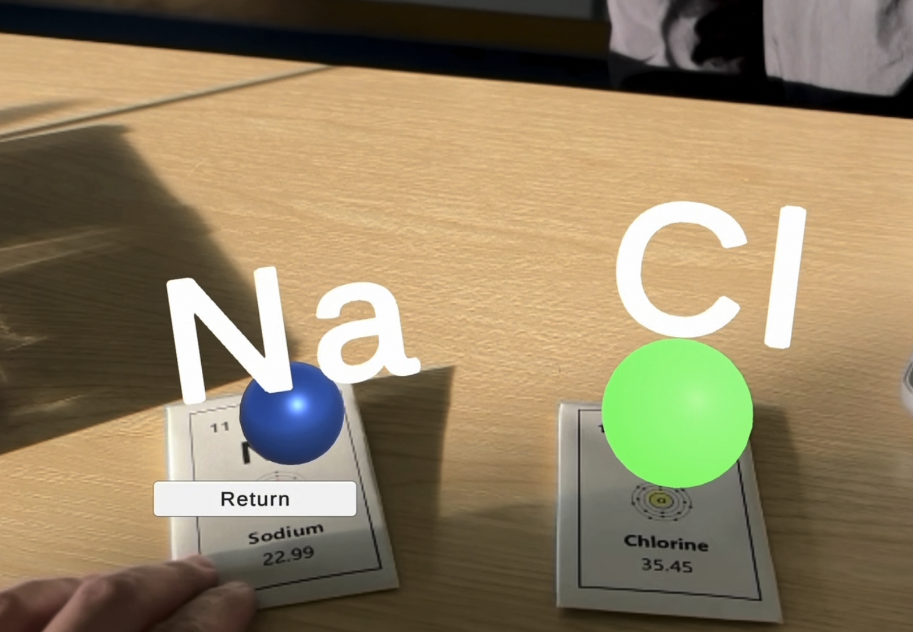
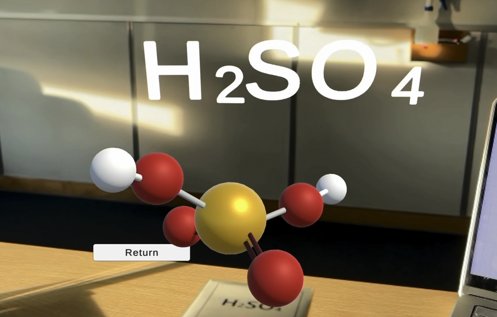
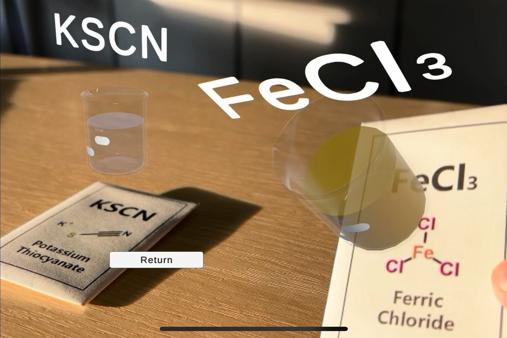
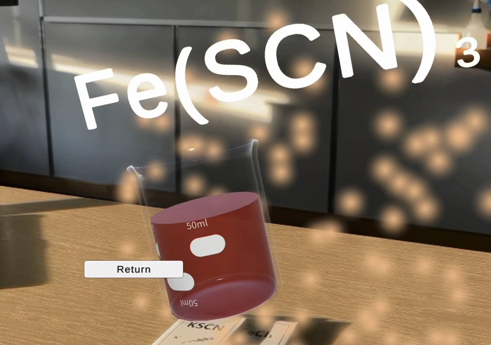

# AR-Chemistry-Laboratory 
# 基于AR的化学实验室体验设计

### Scene 1: Microscopic element structure display and reaction effect
### 场景1：微观元素结构展示和反应效果
  
  
### Scene 2: Macroscopic Observation of Chemical experiments
### 场景2：化学实验宏观观测
  
  
### Scene 3: Chemistry classroom teaching video
### 场景3：化学课堂教学视频

> The chemical experiment video in Scene 3 is from the blogger @JeyJey-EN. The blogger's homepage:  
https://www.youtube.com/@JeyJey-EN  
> 场景3中化学实验视频来自博主@JeyJey-EN，博主主页：  
https://www.youtube.com/@JeyJey-EN
